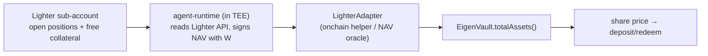

# ARCHITECTURE

How the three planes fit, what enforces the trust guarantees, and how a dollar
moves through deposit → trade → redeem. The "what and why" narrative lives in
the root [`README.md`](./README.md); this doc is the implementation map. The
operational runbook is [`BUILD.md`](./BUILD.md).

The one-line claim the whole design defends: **the manager can't silently swap
strategy, and can't drain investor funds to an arbitrary address.** Everything
below is in service of that.

---

## Trust model

Two layers, composed (defense-in-depth) — the onchain **custody gate** and the
measured **execution shell** — neither trusted alone:

### 1. TEE attestation → `teeWallet` gating (onchain, load-bearing)

- The strategy runs in an EigenCompute **TEE**. The attestation produces an
  **image hash `H`** (a digest of exactly what's running) and a **KMS-derived
  wallet `W = f(H)`**. Change the code → new `H` → new `W`.
- `VaultFactory.createVault` pins `(H, W)` into the vault and binds it in
  `AttestationRegistry` (`bind(vault, imageHash, teeWallet, attestation)` —
  verified before acceptance; see README §3).
- `EigenVault.bridgeToLighter` / `bridgeFromLighter` are **`teeWallet`-gated**:
  only `W` can move USDC, and only along the vault ↔ Lighter sub-account path.
  A leaked key therefore can't redirect funds to an attacker address — the
  worst case is forced movement *within* the vault/Lighter boundary.
- Rotating strategy is a **public** action: `proposeImage(newHash, newWallet)`
  opens a redemption window before `acceptImage` swaps `(imageHash, teeWallet)`.
  Investors get an exit before the new code can trade. (README §2 invariants.)

### 2. The NemoClaw Shell: a measured boundary around a *mutable* agent

The contract gate bounds *where funds can go*. The NemoClaw Shell bounds *what
the agent can do*. This is the load-bearing idea of the whole design, and it is
**nested**:

```
┌─ EigenCompute instance (one per vault, attested) ───────────────┐
│  ┌─ NemoClaw Shell (open-source, MEASURED, on-chain bound) ───┐  │
│  │   • Policy engine        (asset / leverage / concentration)│  │
│  │   • Lighter order gateway (the ONLY path to the exchange)  │  │
│  │   • Skill loader + skill-hash registry check               │  │
│  │   • Attestation producer  (per-order + heartbeat)          │  │
│  │   • Vault accounting      (deposits / shares / fees / HWM)  │  │
│  │   ┌─ Agent (deployer-owned, SECRET, MUTABLE) ───────────┐  │  │
│  │   │   • Thematic mandate prompt                         │  │  │
│  │   │   • Skills: research / analysis / sizing / exec     │  │  │
│  │   │   • Models, MCP servers, data sources               │  │  │
│  │   │   • Hermes-style runtime skill updates              │  │  │
│  │   └─────────────────────────────────────────────────────┘  │  │
│  └────────────────────────────────────────────────────────────┘  │
└──────────────────────────────────────────────────────────────────┘
                              │ orders
                              ▼
                       Lighter exchange
```

What's attested and pinned on-chain (`imageHash`, via `AttestationRegistry`) is
the **Shell** — the open, measured enforcement layer — *not* the agent. The
agent inside is the builder's edge: private, and free to mutate (swap models,
add MCP tools, hot-update skills Hermes-style). That mutability is safe because
the agent can only ever act *through* the shell:

- **The agent proposes; the shell disposes.** The agent returns *intents*; it
  has no handle to the Lighter client. Every intent passes the shell's **policy
  engine** (the published guardrails — markets, leverage, concentration) and is
  submitted only via the shell's **order gateway**, the sole egress to the
  exchange (a NemoClaw OpenShell network allowlist denies every other host, so
  the agent can't reach Lighter, the KMS, or anything else directly).
- **Skills are hash-checked.** The shell's skill loader computes each skill's
  hash and refuses (fail-closed) to run any skill not present in the on-chain
  **`SkillRegistry`** for this vault. The builder registers a skill's hash
  on-chain *before* the shell will load it. So investors see *that* the agent
  changed (the skill hashes are public — a transparency log) without seeing the
  secret skill *content*, and a silently-injected skill simply won't run.
- **Attestation is continuous.** The shell produces a **per-order** attestation
  (signed by `W`) and posts a periodic **heartbeat** on-chain
  (`SkillRegistry.heartbeat(vault, ordersRoot, navRoot, attestation)`) — a
  rolling commitment to the orders it placed and the NAV it reported.

The three layers compose: attestation guarantees *which shell* holds the key;
the shell's policy engine + sole gateway + skill-hash check constrain *what the
agent can do with it*; and `teeWallet` gating constrains *where funds can go*.
A mutated or malicious agent never escapes the measured shell.

> Threats and mitigations are tabulated in [`README.md` → Threat Model](./README.md#threat-model-high-level).

---

## Component map

Which directory implements which part of the README architecture:

| Plane | Directory | Implements (README §) | Key files |
|---|---|---|---|
| **Custody** (onchain) | [`contracts/`](./contracts/) | §1 VaultFactory, §2 EigenVault, §3 AttestationRegistry, §4 FeeAccountant, §5 LighterAdapter | `src/VaultFactory.sol`, `src/EigenVault.sol`, `src/AttestationRegistry.sol`, `src/FeeAccountant.sol`, `src/adapters/LighterAdapter.sol`, `src/SkillRegistry.sol`, `script/Deploy.s.sol` |
| **Skill / attestation anchor** | [`contracts/`](./contracts/) | on-chain skill-hash allowlist + heartbeat log | `src/SkillRegistry.sol` (`isAllowedSkill`, `heartbeat`) |
| **Execution** — the Shell | [`agent-runtime/`](./agent-runtime/) | §5 (off-chain SDK side), §6 EigenCompute Image; the five shell responsibilities | `shell/shell.py` (run loop), `shell/order_gateway.py` (sole Lighter path), `shell/skill_loader.py` (hash check), `shell/attestation.py` (per-order + heartbeat), `Dockerfile` |
| **Execution** — the Agent | [`agent-runtime/`](./agent-runtime/) | deployer-owned mutable agent (mandate + skills + models/MCP) | `shell/agent.py` (`Agent`, `Skill`, `ReferenceAgent`) |
| **Execution** sandbox/ship | [`deploy/`](./deploy/) | §6 image deploy under NemoClaw | `deploy.sh` |
| **Strategy authoring** | [`agent-sdk/`](./agent-sdk/) | the `Strategy.decide` interface + vault/Lighter clients | `eigenstrategies_sdk/vault_client.py` (the on-chain ABI surface the TEE calls), strategy base |
| **Reference strategy** | [`agents/funding-carry/`](./agents/funding-carry/) | delta-neutral funding carry | `strategy.py`, `Dockerfile` |
| **Frontend** | root `*.html`, `*.js` | prototype UI; live-config seam | [`create.js`](./create.js), [`chain.js`](./chain.js), [`deployments.example.json`](./deployments.example.json) |

The vault ABI the TEE actually calls is concretely visible in
[`agent-sdk/eigenstrategies_sdk/vault_client.py`](./agent-sdk/eigenstrategies_sdk/vault_client.py):
`bridgeToLighter`, `bridgeFromLighter`, `accrueTxFee`, `realizePerfFee`,
`totalAssets`, `imageHash`, `teeWallet`, plus `AttestationRegistry.bind`. That
file is the contract/runtime interface contract — keep it in sync with
`contracts/`.

---

## NAV oracle path

Share price = `(USDC in vault + USDC value of the linked Lighter sub-account) /
totalSupply`. The vault holds the first term directly; the second lives on
Lighter and must be read in:



- **v1:** the TEE-signed pusher — the runtime reads the sub-account, signs the
  NAV with `W`, and the `LighterAdapter` exposes it to `totalAssets()`. Trust
  rides on the attestation (the same `W` that's allowed to trade reports NAV).
- **v2:** a Lighter-native ZK proof of sub-account balance replaces the trusted
  pusher (README §5, Threat Model row "NAV oracle lies").

Cadence (per-fill vs. pull-on-deposit/redeem) is an open question in
[`README.md` → Open Questions](./README.md#open-questions-to-resolve-before-implementation-phase);
the stale-NAV arbitrage window is the trade-off being priced.

---

## Lifecycle: deposit → trade → redeem

The end-to-end accounting, with the file that owns each step. (The full
sequence diagram is in [`README.md` → Sequence](./README.md#sequence-investor-deposit--trade--exit); this is the file-level cross-reference.)

1. **Publish.** `make agent-build` + `make deploy` →
   [`deploy/deploy.sh`](./deploy/) ships the NemoClaw-wrapped image to
   EigenCompute, returns `(H, W, appId)`. On boot the runtime posts its
   attestation via `AttestationRegistry.bind` (`vault_client.bind_attestation`).
2. **Create.** `VaultFactory.createVault(VaultParams)` deploys the `EigenVault`,
   pins `(H, W)`, and registers it. Frontend equivalent: [`create.js`](./create.js)
   (`createVault()`), which persists the vault to
   `localStorage["eigenstrategies:vaults"]` and, when `window.CHAIN.isLive()`,
   notes it would submit the real tx.
3. **Deposit.** Investor calls `EigenVault.deposit(usdc, receiver)` → mints
   shares at current NAV (NAV per the oracle path above).
4. **Trade.** Runtime (`vault_client.bridge_to_lighter`) pulls a tranche to
   Lighter, registers `W` as the sub-account API key, runs
   `decide()` → sign → submit, and on each fill calls
   `accrueTxFee(notional)` (`vault_client.accrue_tx_fee`) → `FeeAccountant`
   mints tx-fee shares to the builder.
5. **Redeem.** Investor calls `redeem(shares)`. If free USDC is short, the vault
   asks the runtime (off-chain webhook) to `bridgeFromLighter` enough to cover
   (`vault_client.bridge_from_lighter`). `realizePerfFee()` runs first (HWM:
   mint `pnlAboveHWM * perfFeeBps / 1e4` shares to builder, advance HWM), then
   the investor receives their pro-rata USDC.
6. **Builder fees.** Builder redeems the fee shares minted in steps 4–5 for
   USDC.

USDC accounting closes to zero across the cycle — verify on paper against the
interfaces in [`README.md` → Components](./README.md#components--contract-interfaces),
which is the design's own first acceptance test.

---

## See also

- [`BUILD.md`](./BUILD.md) — run the whole stack, step by step.
- [`README.md`](./README.md) — product framing, full interfaces, threat model.
- [`deployments.example.json`](./deployments.example.json) /
  [`chain.js`](./chain.js) — the frontend ↔ live-deployment seam.
