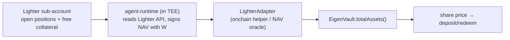

# ARCHITECTURE

How the three planes fit, what enforces the trust guarantees, and how a dollar
moves through deposit → trade → redeem. The "what and why" narrative lives in
the root [`README.md`](./README.md); this doc is the implementation map. The
operational runbook is [`BUILD.md`](./BUILD.md).

The one-line claim the whole design defends: **the manager can't silently swap
strategy, and can't drain investor funds to an arbitrary address.** Everything
below is in service of that.

---

## Trust model

Two independent mechanisms, layered (defense-in-depth) — neither is trusted
alone:

### 1. TEE attestation → `teeWallet` gating (onchain, load-bearing)

- The strategy runs in an EigenCompute **TEE**. The attestation produces an
  **image hash `H`** (a digest of exactly what's running) and a **KMS-derived
  wallet `W = f(H)`**. Change the code → new `H` → new `W`.
- `VaultFactory.createVault` pins `(H, W)` into the vault and binds it in
  `AttestationRegistry` (`bind(vault, imageHash, teeWallet, attestation)` —
  verified before acceptance; see README §3).
- `EigenVault.bridgeToLighter` / `bridgeFromLighter` are **`teeWallet`-gated**:
  only `W` can move USDC, and only along the vault ↔ Lighter sub-account path.
  A leaked key therefore can't redirect funds to an attacker address — the
  worst case is forced movement *within* the vault/Lighter boundary.
- Rotating strategy is a **public** action: `proposeImage(newHash, newWallet)`
  opens a redemption window before `acceptImage` swaps `(imageHash, teeWallet)`.
  Investors get an exit before the new code can trade. (README §2 invariants.)

### 2. NemoClaw egress allowlist (in-TEE, defense-in-depth)

The contract gate bounds *where funds can go*. NemoClaw bounds *what the
container can reach*: the agent image is wrapped in a NemoClaw sandbox with a
network **egress allowlist** (RPC, Lighter API, EigenCompute KMS — nothing
else). So even a malicious or compromised strategy inside the attested image
cannot exfiltrate the KMS-injected mnemonic or phone home to an arbitrary host.

The two compose: attestation guarantees *which* code holds the key and binds
fund-movement to it; NemoClaw constrains that code's blast radius. Lose one and
the other still holds the core invariant.

> Threats and mitigations are tabulated in [`README.md` → Threat Model](./README.md#threat-model-high-level).

---

## Component map

Which directory implements which part of the README architecture:

| Plane | Directory | Implements (README §) | Key files |
|---|---|---|---|
| **Custody** (onchain) | [`contracts/`](./contracts/) | §1 VaultFactory, §2 EigenVault, §3 AttestationRegistry, §4 FeeAccountant, §5 LighterAdapter | `src/VaultFactory.sol`, `src/EigenVault.sol`, `src/AttestationRegistry.sol`, `src/FeeAccountant.sol`, `src/adapters/LighterAdapter.sol`, `script/Deploy.s.sol` |
| **Execution** (TEE) | [`agent-runtime/`](./agent-runtime/) | §5 (off-chain SDK side), §6 EigenCompute Image | `Dockerfile`, runtime boot/loop, attestation post |
| **Execution** sandbox/ship | [`deploy/`](./deploy/) | §6 image deploy under NemoClaw | `deploy.sh` |
| **Strategy authoring** | [`agent-sdk/`](./agent-sdk/) | the `Strategy.decide` interface + vault/Lighter clients | `eigenstrategies_sdk/vault_client.py` (the on-chain ABI surface the TEE calls), strategy base |
| **Reference strategy** | [`agents/funding-carry/`](./agents/funding-carry/) | delta-neutral funding carry | `strategy.py`, `Dockerfile` |
| **Frontend** | root `*.html`, `*.js` | prototype UI; live-config seam | [`create.js`](./create.js), [`chain.js`](./chain.js), [`deployments.example.json`](./deployments.example.json) |

The vault ABI the TEE actually calls is concretely visible in
[`agent-sdk/eigenstrategies_sdk/vault_client.py`](./agent-sdk/eigenstrategies_sdk/vault_client.py):
`bridgeToLighter`, `bridgeFromLighter`, `accrueTxFee`, `realizePerfFee`,
`totalAssets`, `imageHash`, `teeWallet`, plus `AttestationRegistry.bind`. That
file is the contract/runtime interface contract — keep it in sync with
`contracts/`.

---

## NAV oracle path

Share price = `(USDC in vault + USDC value of the linked Lighter sub-account) /
totalSupply`. The vault holds the first term directly; the second lives on
Lighter and must be read in:

- **v1:** the TEE-signed pusher — the runtime reads the sub-account, signs the
  NAV with `W`, and the `LighterAdapter` exposes it to `totalAssets()`. Trust
  rides on the attestation (the same `W` that's allowed to trade reports NAV).
- **v2:** a Lighter-native ZK proof of sub-account balance replaces the trusted
  pusher (README §5, Threat Model row "NAV oracle lies").

Cadence (per-fill vs. pull-on-deposit/redeem) is an open question in
[`README.md` → Open Questions](./README.md#open-questions-to-resolve-before-implementation-phase);
the stale-NAV arbitrage window is the trade-off being priced.

---

## Lifecycle: deposit → trade → redeem

The end-to-end accounting, with the file that owns each step. (The full
sequence diagram is in [`README.md` → Sequence](./README.md#sequence-investor-deposit--trade--exit); this is the file-level cross-reference.)

1. **Publish.** `make agent-build` + `make deploy` →
   [`deploy/deploy.sh`](./deploy/) ships the NemoClaw-wrapped image to
   EigenCompute, returns `(H, W, appId)`. On boot the runtime posts its
   attestation via `AttestationRegistry.bind` (`vault_client.bind_attestation`).
2. **Create.** `VaultFactory.createVault(VaultParams)` deploys the `EigenVault`,
   pins `(H, W)`, and registers it. Frontend equivalent: [`create.js`](./create.js)
   (`createVault()`), which persists the vault to
   `localStorage["eigenstrategies:vaults"]` and, when `window.CHAIN.isLive()`,
   notes it would submit the real tx.
3. **Deposit.** Investor calls `EigenVault.deposit(usdc, receiver)` → mints
   shares at current NAV (NAV per the oracle path above).
4. **Trade.** Runtime (`vault_client.bridge_to_lighter`) pulls a tranche to
   Lighter, registers `W` as the sub-account API key, runs
   `decide()` → sign → submit, and on each fill calls
   `accrueTxFee(notional)` (`vault_client.accrue_tx_fee`) → `FeeAccountant`
   mints tx-fee shares to the builder.
5. **Redeem.** Investor calls `redeem(shares)`. If free USDC is short, the vault
   asks the runtime (off-chain webhook) to `bridgeFromLighter` enough to cover
   (`vault_client.bridge_from_lighter`). `realizePerfFee()` runs first (HWM:
   mint `pnlAboveHWM * perfFeeBps / 1e4` shares to builder, advance HWM), then
   the investor receives their pro-rata USDC.
6. **Builder fees.** Builder redeems the fee shares minted in steps 4–5 for
   USDC.

USDC accounting closes to zero across the cycle — verify on paper against the
interfaces in [`README.md` → Components](./README.md#components--contract-interfaces),
which is the design's own first acceptance test.

---

## See also

- [`BUILD.md`](./BUILD.md) — run the whole stack, step by step.
- [`README.md`](./README.md) — product framing, full interfaces, threat model.
- [`deployments.example.json`](./deployments.example.json) /
  [`chain.js`](./chain.js) — the frontend ↔ live-deployment seam.
