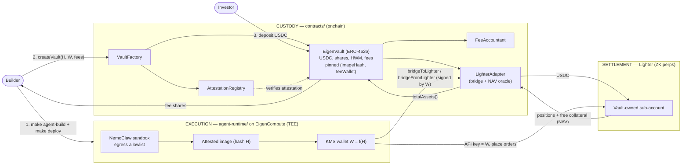

# BUILD — end-to-end runbook

Stand the whole stack up from a clean checkout: build and test the contracts,
build and ship the agent image into a NemoClaw-sandboxed EigenCompute TEE,
create a vault, fund it with USDC, watch it trade on Lighter, and see it on the
frontend.

This is the connective-tissue doc. The deep detail lives in each plane's own
README:

- Contracts (custody): [`contracts/`](./contracts/) — `forge` project, `script/Deploy.s.sol`.
- Agent runtime + sandbox (execution): [`agent-runtime/`](./agent-runtime/), [`deploy/`](./deploy/).
- Strategy SDK: [`agent-sdk/`](./agent-sdk/) and reference agent [`agents/funding-carry/`](./agents/funding-carry/).
- Architecture / trust model: [`ARCHITECTURE.md`](./ARCHITECTURE.md).

Everything below is orchestrated by the top-level [`Makefile`](./Makefile);
run `make help` for the target list.

---

## The three planes



- **Control flow** rides top-to-bottom: the builder publishes the image, the
  factory deploys the vault, investors deposit. The TEE wallet `W` is the only
  key that can move USDC between vault and Lighter.
- **Data flow** rides bottom-to-top: Lighter sub-account state (positions +
  free collateral) is read by the `LighterAdapter` NAV oracle and surfaces in
  `EigenVault.totalAssets()`, which sets the share price investors deposit and
  redeem at.

NemoClaw and the onchain `teeWallet` gate are **defense-in-depth**: the contract
already restricts fund movement to `W` and to the vault↔Lighter path; NemoClaw
additionally restricts what the container can reach on the network, so a
compromised strategy can't exfiltrate the key or call arbitrary endpoints. See
[`ARCHITECTURE.md`](./ARCHITECTURE.md#trust-model).

---

## Prerequisites

| Tool | Why | Install |
|---|---|---|
| **Foundry** (`forge`, `cast`) | build/test/deploy contracts | `curl -L https://foundry.paradigm.xyz \| bash && foundryup` |
| **Docker** | build the `agent-runtime` image (`linux/amd64`) | https://docs.docker.com/get-docker/ |
| **ecloud CLI** | deploy to EigenCompute | per [`deploy/`](./deploy/) README |
| **Node** ≥ 18 | agent-runtime tooling (per `agent-runtime/`) | https://nodejs.org |
| **Python** ≥ 3.12 | `agent-sdk`, and `python3 -m http.server` for the prototype | https://www.python.org |

An RPC URL and a funded deployer key are needed for the on-chain steps; testnet
(e.g. Arbitrum Sepolia) is fine. USDC on that chain is needed to fund a vault.

---

## Ordered steps

### 0. Install deps

```bash
git clone --recurse-submodules <repo> && cd lighteragent
# contracts submodules (forge-std, openzeppelin) if not already vendored:
cd contracts && forge install && cd ..
# python SDK (editable) for local strategy iteration:
pip install -e agent-sdk
```

### 1. Build + test the contracts (custody plane)

```bash
make contracts-build    # cd contracts && forge build
make contracts-test     # cd contracts && forge test -vv
```

Both targets are defensive — if `contracts/` or `forge` is missing they print a
hint and skip. See [`contracts/`](./contracts/) for the full contract set
(`VaultFactory`, `EigenVault`, `AttestationRegistry`, `FeeAccountant`,
`LighterAdapter`).

### 2. Deploy the contracts

Run the Foundry deploy script against your RPC. It deploys the factory,
registry, fee accountant, and Lighter adapter, and prints their addresses.

```bash
cd contracts
forge script script/Deploy.s.sol \
  --rpc-url "$RPC_URL" \
  --private-key "$DEPLOYER_PK" \
  --broadcast
cd ..
```

Record the addresses into `deployments.json` (copy the shape from
[`deployments.example.json`](./deployments.example.json)). This is what the
frontend reads to talk to a live deployment — see
[Pointing the frontend at a live deployment](#pointing-the-frontend-at-a-live-deployment).

### 3. Build the agent image (execution plane)

```bash
make agent-build        # docker build --platform linux/amd64 -t eigenstrategies/agent-runtime:dev agent-runtime
```

The image bundles the `agent-sdk` runtime and your strategy module. The
reference strategy is [`agents/funding-carry/`](./agents/funding-carry/) — fork
it and change `decide()`.

### 4. Deploy to EigenCompute under NemoClaw

```bash
make deploy             # runs deploy/deploy.sh
```

[`deploy/deploy.sh`](./deploy/) wraps the image in the **NemoClaw** sandbox
(network egress allowlist) and pushes it to EigenCompute via the `ecloud` CLI.
On success it returns the **attested image hash `H`**, the **KMS-derived TEE
wallet `W`**, and an app id. `W` is deterministically derived from `H`, so the
hash investors see is bound to the only key that can trade.

### 5. createVault

Two ways:

- **UI:** open the [Create vault](./create.html) page, paste the image hash +
  TEE wallet, set fees, and list. (On the prototype this is simulated; with
  `deployments.json` present the page notes it would submit a real tx — see
  step 8.)
- **Direct:** call `VaultFactory.createVault(VaultParams)` with
  `cast send` / your script, passing `(imageHash, teeWallet, perfFeeBps,
  txFeeBps, builder, metadataURI)`. The factory deploys the `EigenVault` and
  binds `(vault → imageHash, teeWallet)` in `AttestationRegistry`.

### 6. Fund USDC

Deposit USDC into the vault (mints ERC-4626 shares at current NAV):

```bash
cast send "$USDC"   "approve(address,uint256)" "$VAULT" 1000000000 --rpc-url "$RPC_URL" --private-key "$PK"
cast send "$VAULT"  "deposit(uint256,address)"  1000000000 "$YOUR_ADDR" --rpc-url "$RPC_URL" --private-key "$PK"
# 1000000000 = 1000 USDC (6 decimals)
```

### 7. Watch it trade

The TEE agent pulls a tranche to Lighter (`bridgeToLighter`, signed by `W`),
registers `W` as an API key on the vault's Lighter sub-account, and runs its
loop: fetch state → `Strategy.decide()` → sign + submit → on fill,
`accrueTxFee(notional)`. The `LighterAdapter` NAV oracle feeds sub-account
state back into `totalAssets()`. Watch logs via the `ecloud` CLI (see
[`deploy/`](./deploy/)); confirm fills and that NAV moves.

### 8. See it on the frontend

```bash
make web                # python3 -m http.server 8000
# open http://localhost:8000
```

The prototype renders against mock data by default. Created vaults are
persisted client-side under `localStorage["eigenstrategies:vaults"]` (written by
[`create.js`](./create.js)), so a vault you list in the UI shows up on the
discover and vault pages.

---

## Pointing the frontend at a live deployment

The prototype is offline-first; pointing it at real addresses is a single,
**non-breaking** seam — [`chain.js`](./chain.js):

1. Copy [`deployments.example.json`](./deployments.example.json) to
   `deployments.json` and fill in the addresses from step 2 (keyed by decimal
   chainId).
2. Include `chain.js` on the pages that should go live, **before** the page
   script, e.g. in `create.html`:

   ```html
   <script src="chain.js"></script>
   ```

   `chain.js` fetches `deployments.json` best-effort. If it's missing,
   unreachable, or still all-placeholder, the app stays in
   prototype/simulated mode exactly as today.

3. Read config after the `chain:ready` event (or just `window.CHAIN`):

   ```js
   document.addEventListener("chain:ready", () => {
     if (window.CHAIN.isLive()) {
       console.log("live on", window.CHAIN.chainId, window.CHAIN.addresses);
     }
   });
   ```

`create.js` already checks `window.CHAIN?.isLive?.()` in its deploy log and
notes when it would submit a real `VaultFactory` tx — harmless when `chain.js`
isn't loaded (the check short-circuits to the simulated branch).

> Note: wiring `chain.js` into the HTML pages is intentionally **not** done yet.
> The module + example config ship so the change is non-breaking; add the
> `<script>` tags when you actually point a deployment.
