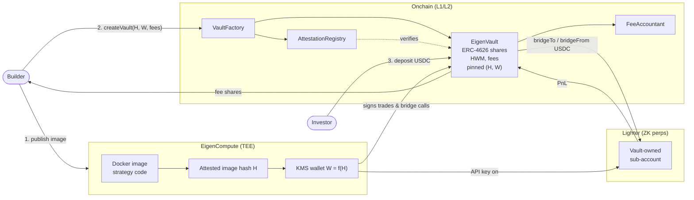
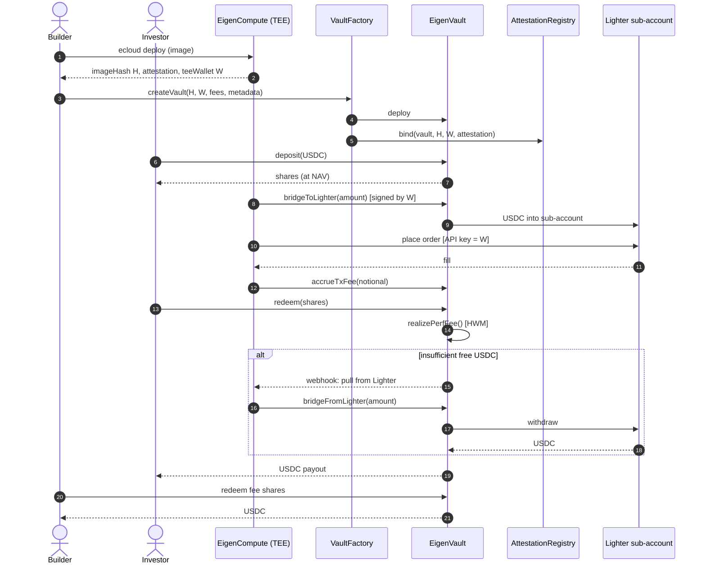

# EigenVaults

A permissionless, attested agent-vault platform where anyone can build, deploy, and run a trading agent on EigenCloud. Investors deposit USDC into a per-agent ERC-4626 vault and are traded by the same algorithm under shared accounting. The vault builder earns configurable transaction-fee and performance-fee shares.

**Live prototype:** https://chainyoda.github.io/lighteragent/

## Repo layout

| Path | What |
|---|---|
| [`agent-sdk/`](./agent-sdk/) | Python SDK — implement one `Strategy.decide` method, ship. Handles attestation, Lighter signing, fee accrual. |
| [`agents/funding-carry/`](./agents/funding-carry/) | Reference agent: delta-neutral funding-rate carry across BTC/ETH/SOL perps. |
| `index.html` `vault.html` `create.html` | Frontend prototype (also on GitHub Pages). |
| `wallet.js` | EIP-6963 wallet connection (MetaMask, Rabby, Coinbase, etc.). |

## Build an agent in 30 lines

```python
from decimal import Decimal
from eigenvaults_sdk import Strategy, MarketState, Order, run_agent

class MyStrategy(Strategy):
    tick_seconds = 30
    def decide(self, state: MarketState):
        if not state.positions and state.free_collateral > Decimal(100):
            yield Order(market="BTC-PERP", side="long", size=Decimal("0.001"))

if __name__ == "__main__":
    run_agent(MyStrategy(), markets=["BTC-PERP"])
```

Then `ecloud compute app deploy` and paste the returned image hash into the
[Create vault](https://chainyoda.github.io/lighteragent/create.html) form. See
the [SDK README](./agent-sdk/) and [reference agent](./agents/funding-carry/)
for the full picture.

---

## Context

An Eigen reference app for the "anyone-builds-and-anyone-invests" pattern: pooled capital traded by a single algorithm with a creator-share. The closest existing primitives are Hyperliquid Vaults and **Lighter Public Pools**.

Lighter Public Pools today are:
- **Permissioned** (operators must be whitelisted).
- **Off-chain accounting** — shares live inside an operator sub-account, not as ERC-20s.
- **Strategy-opaque** — depositors trust the operator, with no cryptographic guarantee that the running code matches what was advertised.

EigenVaults closes all three gaps and turns each into an Eigen primitive:

| Gap in Lighter Public Pools  | EigenVaults answer                                                                 |
| ---------------------------- | ---------------------------------------------------------------------------------- |
| Permissioned operators       | Permissionless `VaultFactory` — anyone deploys a vault.                            |
| Off-chain shares             | ERC-4626 share token, composable in DeFi.                                          |
| "Trust the operator"         | Vault pins an **EigenCompute attested image hash**; trade authority bound to KMS wallet derived from that attestation. Builder cannot silently swap strategy. |

Output of this round, per user direction: **architecture doc + contract interfaces only**. No implementation breakdown, no frontend plan.

Locked-in design choices (from clarifying questions):
- **Venue:** Lighter perps (ZK-rollup orderbook, sub-account model, API-key signing).
- **Custody:** ERC-4626 vault per agent; trading key held inside the EigenCompute TEE.
- **Trust model:** Onchain pinning of EigenCompute image hash; trade-authority wallet derived via EigenCompute KMS bound to that attestation.
- **Fees:** Builder picks freely at vault creation (no protocol caps). Frontend filters spam.

---

## System Overview



Three planes:

1. **Custody plane (onchain).** USDC sits in `EigenVault`. Investors mint/burn shares. Only the registered TEE wallet `W` can move funds to/from the Lighter bridge contract on behalf of the vault.
2. **Execution plane (EigenCompute).** The strategy container runs in a TEE. KMS-provisioned mnemonic gives it `W`'s key. It calls Lighter's API to register `W` as an API key on the vault's Lighter sub-account, then submits orders.
3. **Settlement plane (Lighter).** Each vault owns one Lighter sub-account, derived deterministically from the vault address. PnL realized there flows back through Lighter's withdrawal contract into `EigenVault` whenever the strategy chooses (or on investor exit).

---

## Components & Contract Interfaces

All contracts live in `contracts/` of a future monorepo. Solidity interface sketches; implementation details deferred.

### 1. `VaultFactory`

Permissionless entry point. Deploys a vault, registers it in `AttestationRegistry`, and emits the publish event the indexer/frontend consume.

```solidity
interface IVaultFactory {
    struct VaultParams {
        bytes32 imageHash;          // EigenCompute attested image digest
        address teeWallet;          // KMS-derived wallet bound to imageHash
        uint16  perfFeeBps;         // builder-chosen, no protocol cap
        uint16  txFeeBps;           // applied per-trade on notional
        address builder;            // recipient of fees
        string  metadataURI;        // IPFS: name, desc, risk profile
    }

    event VaultCreated(address vault, address builder, bytes32 imageHash);

    function createVault(VaultParams calldata p) external returns (address vault);
}
```

### 2. `EigenVault` (ERC-4626)

Per-agent vault. USDC-denominated. Standard 4626 deposit/redeem; fees and trade-authority on top.

```solidity
interface IEigenVault is IERC4626 {
    // Trade authority -----------------------------------------------------
    function teeWallet() external view returns (address);
    function imageHash() external view returns (bytes32);

    // Lighter bridge moves -----------------------------------------------
    // Only callable by teeWallet. Pulls/pushes USDC between this vault
    // and Lighter's deposit contract for this vault's sub-account.
    function bridgeToLighter(uint256 assets) external;
    function bridgeFromLighter(uint256 assets) external;

    // Fee accrual (called by FeeAccountant, see §4) -----------------------
    function accrueTxFee(uint256 notional) external;
    function realizePerfFee() external returns (uint256 sharesMinted);

    // Governance: rotate to a new attested image (emits event; investors
    // get a window to redeem at last HWM before the new image takes over).
    function proposeImage(bytes32 newHash, address newWallet) external;
    function acceptImage() external;
}
```

Key invariants:

- `teeWallet` is the **only** address allowed to call `bridgeToLighter` / `bridgeFromLighter`.
- `imageHash` is **immutable per epoch**. `proposeImage` opens a redemption window (e.g., 24h) before `acceptImage` rotates `(imageHash, teeWallet)`.
- Share price = `(USDC in vault + USDC in linked Lighter sub-account) / totalSupply`. The Lighter side is read via an oracle/adapter (see §5).

### 3. `AttestationRegistry`

Onchain pin of `(vault → imageHash, teeWallet)`. Verifies an EigenCompute attestation token before accepting a binding. Two implementation paths to evaluate later:

- **A. Light verifier:** trust an EigenLayer AVS that posts attestation results (cheap, depends on AVS availability).
- **B. Onchain verifier:** verify the attestation signature directly against a known KMS root (heavier gas, no extra trust hop).

```solidity
interface IAttestationRegistry {
    function bind(address vault, bytes32 imageHash, address teeWallet, bytes calldata attestation) external;
    function isValid(address vault) external view returns (bool);
    function imageOf(address vault) external view returns (bytes32);
}
```

### 4. `FeeAccountant`

Splits fees between builder and protocol. Two streams:

- **Per-trade fee (`txFeeBps`)** — applied on notional reported by the strategy when it calls `accrueTxFee`. Charged in shares, minted to builder.
- **Performance fee (`perfFeeBps`)** — high-water-mark style. On `realizePerfFee` (typically called on investor exit, or periodically by the strategy), compute `pnlAboveHWM`, mint shares worth `pnlAboveHWM * perfFeeBps / 1e4` to the builder, advance HWM.

Protocol cut is a fixed slice of both, configurable by governance, paid to a treasury address.

```solidity
interface IFeeAccountant {
    function quoteTxFee(uint256 notional, uint16 bps) external view returns (uint256 shares);
    function quotePerfFee(uint256 pnlAboveHWM, uint16 bps) external view returns (uint256 shares);
    function protocolCutBps() external view returns (uint16);
}
```

### 5. `LighterAdapter`

Off-chain library + thin onchain helper. Two responsibilities:

1. **Vault → Lighter bridge.** Wraps Lighter's deposit/withdraw smart contracts. Each vault owns one Lighter sub-account whose ETH-wallet is the vault contract itself; the API-key signer is `teeWallet`.
2. **NAV oracle.** Reads (open positions + free collateral) for the vault's sub-account from Lighter and exposes it to `EigenVault.totalAssets()`. For v1, an off-chain pusher signed by the TEE is acceptable; for v2, a Lighter-native ZK proof of sub-account balance.

Off-chain SDK side (lives in `agent-runtime/`, not in `contracts/`):

```ts
// Strategy authors implement this interface.
interface Strategy {
  decide(state: MarketState): Promise<Order[]>;
}
```

The runtime wraps `Strategy.decide`, signs orders with the KMS-provided mnemonic, calls `accrueTxFee` after each fill, and pushes NAV updates.

### 6. `EigenCompute Image` (off-chain artifact, not a contract)

Reference Docker image (`linux/amd64`, root, EXPOSE port for healthcheck) that:

- Reads `MNEMONIC` from KMS-injected env at runtime.
- Loads the strategy module.
- On boot: registers itself as an API key on its Lighter sub-account, posts an attestation token to `AttestationRegistry.bind` (one-time).
- Main loop: fetch market state → `Strategy.decide` → sign + submit → on fill, call `EigenVault.accrueTxFee`.

Three template flavors at MVP: TS, Python, Rust. (Picked from EigenCompute's official template list.)

---

## Sequence: Investor deposit → trade → exit



1. **Builder deploys image** via `ecloud compute app deploy`, gets back `(imageHash, attestationToken, teeWallet)`.
2. **Builder calls `VaultFactory.createVault`**, passing the above + fee params + metadataURI. Factory deploys vault, calls `AttestationRegistry.bind`.
3. **Investor calls `EigenVault.deposit(usdc, receiver)`**. Mints shares at current NAV.
4. **Strategy** (running in TEE): pulls a tranche to Lighter via `bridgeToLighter`, places orders, on each fill calls `accrueTxFee`.
5. **Investor exits** via `redeem(shares)`. Vault checks free USDC; if insufficient, the strategy is asked (off-chain via webhook) to `bridgeFromLighter` enough to cover. `realizePerfFee` runs first, then the investor receives `(remaining USDC * shares / totalSupply)`.
6. **Builder withdraws fees** by redeeming the shares minted to them by `FeeAccountant`.

---

## Threat Model (high-level)

| Threat                                                   | Mitigation                                                                                  |
| -------------------------------------------------------- | ------------------------------------------------------------------------------------------- |
| Builder swaps strategy after attracting deposits         | `imageHash` immutable per epoch; `proposeImage` opens redemption window before rotation.    |
| TEE wallet key leaks                                     | Bridge functions are `teeWallet`-gated, but funds can only move between vault ↔ Lighter sub-account ↔ vault. They cannot be drained to an arbitrary address. |
| Builder front-runs investor deposits/withdrawals         | Use redemption queue + NAV snapshot at request time, not at execution time.                 |
| NAV oracle lies about Lighter sub-account state          | v1: TEE-signed NAV (trust the attestation). v2: ZK proof from Lighter directly.             |
| Lighter halts or sub-account is frozen                   | Out of scope for v1; investors bear venue risk, surfaced in metadata.                       |
| Attestation registry accepts forged attestation          | Choice between AVS-backed and onchain verifier (§3). Pick before contracts are written.     |

---

## Open Questions (to resolve before implementation phase)

1. **Attestation verifier path** — AVS-backed vs. fully onchain. Affects both gas and trust assumptions.
2. **Fee cap policy** — confirmed as "no caps." Surface fees prominently in vault metadata so frontend can warn.
3. **Lighter Public Pools coexistence** — should EigenVaults *also* register as Lighter Public Pools (if/when Lighter opens permissionless creation), or stay sub-account-only? Affects discoverability inside Lighter's UI.
4. **NAV update cadence** — per-fill, per-block, or pull-only on deposit/redeem? Trade-off between gas and stale-NAV arbitrage windows.
5. **Cross-vault rebalancing** — explicitly out of scope for v1; each vault is isolated.

---

## Critical Files (when implementation begins)

This plan does not yet implement, but the eventual layout under `contracts/`:

- `contracts/VaultFactory.sol`
- `contracts/EigenVault.sol`
- `contracts/AttestationRegistry.sol`
- `contracts/FeeAccountant.sol`
- `contracts/adapters/LighterAdapter.sol`
- `contracts/interfaces/I*.sol`

And under `agent-runtime/`:

- `agent-runtime/Dockerfile`
- `agent-runtime/src/index.ts` (boot, KMS, attestation post, main loop)
- `agent-runtime/src/lighter.ts` (signing, order submission, NAV)
- `agent-runtime/src/strategy.ts` (the user-supplied module)

---

## Verification (for the design itself, before any code is written)

- Walk a deposit → trade → redeem cycle on paper using the interfaces above; confirm USDC accounting closes to zero.
- Walk an "evil builder" cycle: builder publishes image A, attracts deposits, then tries to swap to image B mid-flight. Confirm `proposeImage`/`acceptImage` window prevents silent swap.
- Confirm Lighter's API-key model maps cleanly: `teeWallet` is registered as an API key on the vault-owned sub-account; vault contract is the L1 owner of that sub-account.
- Independent review of attestation-registry verifier choice (§3) before locking it in.
