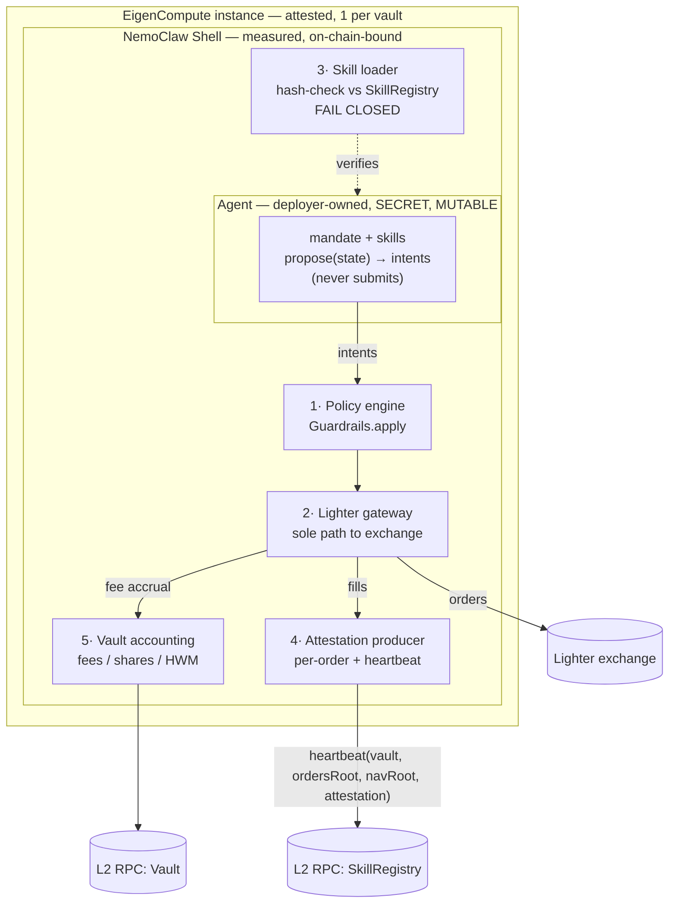

# agent-runtime — LighterClaw execution plane

This directory is the **execution plane** of LighterClaw: the deterministic
trading agent that runs inside an **NVIDIA NemoClaw** OpenShell sandbox on an
**EigenCompute** TEE, deployed via the `ecloud` CLI. It wraps the
`eigenstrategies_sdk` runtime and the chosen strategy (default: the
delta-neutral funding-carry reference agent) into a single attested image.

```
agent-runtime/
├── Dockerfile              # linux/amd64 image (EigenCompute attests its digest = IMAGE_HASH)
├── nemoclaw.policy.yaml    # OpenShell sandbox policy: deny-all egress except Lighter + RPC
├── entrypoint.py           # boots healthcheck, resolves strategy, calls run_agent(...)
├── healthcheck.py          # stdlib HTTP liveness/health probe server ($PORT, default 8080)
├── funding_carry.py        # default strategy shim exposing build() (mirrors agents/funding-carry)
├── shell/                  # NemoClaw Shell: wraps a mutable Agent (SHELL_MODE, default on)
│   ├── agent.py            #   Agent + Skill abstractions; ReferenceAgent (funding-carry as exec skill)
│   ├── skill_loader.py     #   hash-check skills vs on-chain SkillRegistry — FAIL CLOSED
│   ├── order_gateway.py    #   sole path to Lighter: policy engine + submit + fee accrual
│   ├── attestation.py      #   per-order + heartbeat attestation producer (TEE-signed)
│   ├── skill_registry_client.py  # web3 client for SkillRegistry (isAllowedSkill/skillHashes/heartbeat)
│   └── shell.py            #   the run loop tying the five responsibilities together
├── requirements.txt        # deps note (the SDK is pip-installed from ./agent-sdk in the Dockerfile)
└── README.md               # this file
```

The on-chain side (VaultFactory / EigenVault / AttestationRegistry) lives in
`contracts/`; the deployment pipeline that ties image → vault lives in
`deploy/`.

---

## Architecture

```
        ┌─────────────────────── EigenCompute TEE ───────────────────────┐
        │                                                                 │
        │   ┌──────────── NemoClaw OpenShell sandbox ────────────┐        │
        │   │  nemoclaw.policy.yaml: deny-all egress + RO rootfs  │        │
        │   │                                                     │        │
        │   │   entrypoint.py                                     │        │
        │   │     ├─ healthcheck.py  ── :8080 /healthz ───────────┼──► EigenCompute / NemoClaw probe
        │   │     └─ eigenstrategies_sdk.run_agent(strategy)      │        │
        │   │           ├─ VaultClient (web3) ──┐                 │        │
        │   │           └─ LighterClient (httpx)│                 │        │
        │   └───────────────────────────────────┼─────────────────┘        │
        │   KMS-injected secret (mnemonic, RO) ──┘                 │        │
        └──────────────────────────┬──────────────┬───────────────┘
                                   │ (a) 443       │ (b) 443
                                   ▼               ▼
                    mainnet.zklighter.elliot.ai   L2 RPC host
                    (Lighter API + signer)        (vault txs)
```

`run_agent` (in `agent-sdk/eigenstrategies_sdk/runtime.py`) owns the trade loop.
This package only:

1. starts the healthcheck server so probes pass during boot,
2. resolves which strategy to run (`$STRATEGY_MODULE`, default `funding_carry`),
3. instruments the strategy's `decide()` to heartbeat the health server, then
4. hands off to `run_agent(strategy, markets, guardrails)`.

The SDK then, inside the TEE: reads the KMS mnemonic, derives the TEE wallet,
binds the attestation to the vault via `AttestationRegistry.bind`, connects to
Lighter with the pre-registered API key, and loops
`fetch_state → decide → guardrails → submit → accrueTxFee`.

---

## Nested architecture: NemoClaw Shell wraps a mutable Agent (SHELL_MODE)

The execution plane is **nested**. One attested EigenCompute instance per vault
runs the **NemoClaw Shell** — open-source, measured, on-chain-bound. The Shell
*wraps* an **Agent** that is deployer-owned, **secret**, and **mutable**. The
security point: the Agent is private and can be changed at runtime, but it can
**only act through the Shell** — every skill it loads is hash-checked against the
on-chain `SkillRegistry`, and every order flows through the Shell's policy engine
and sole Lighter gateway, with attestations produced per order and on a
heartbeat. The measured Shell is what's attested and pinned on-chain; the Agent's
mutability never escapes the Shell's enforcement.

```
┌──────────────────────── EigenCompute instance (per vault, attested) ────────────────────────┐
│                                                                                              │
│  ┌──────────────────────────── NemoClaw Shell  (measured, on-chain-bound) ───────────────┐  │
│  │   shell/shell.py run loop. Five responsibilities:                                      │  │
│  │     (1) Policy engine        — Guardrails.apply  (asset/leverage/concentration/dd)     │  │
│  │     (2) Lighter gateway       — order_gateway.py  ── the ONLY path to the exchange     │  │
│  │     (3) Skill loader          — skill_loader.py  ── hash-check vs SkillRegistry (FAIL  │  │
│  │     (4) Attestation producer  — attestation.py   ──   CLOSED); per-order + heartbeat   │  │
│  │     (5) Vault accounting       — VaultClient  (deposits/shares/fees/HWM)               │  │
│  │                                                                                        │  │
│  │   ┌────────────── Agent  (deployer-owned, SECRET, MUTABLE) ───────────────┐            │  │
│  │   │   mandate prompt · skills{research,analysis,sizing,exec}              │            │  │
│  │   │   models · MCP servers · data sources · Hermes-style runtime updates  │            │  │
│  │   │   propose(state) -> [Order intents]   (NEVER submits; no exchange key) │            │  │
│  │   └───────────────────────────────────────────────────────────────────────┘            │  │
│  │          │ intents                          ▲ MarketState                              │  │
│  └──────────┼──────────────────────────────────┼──────────────────────────────────────────┘  │
│             ▼ policy-checked, submitted          │ (gateway-mediated reads)                   │
└─────────────┼────────────────────────────────────┼─────────────────────────────────────────────┘
              ▼                                      │
         Lighter exchange  (mainnet/testnet.zklighter.elliot.ai)     SkillRegistry + Vault (L2 RPC)
```



### The five Shell responsibilities (where each lives)

| # | Responsibility | Code | Notes |
|---|---|---|---|
| 1 | **Policy engine** (asset/leverage/concentration limits) | `order_gateway.py` → `Guardrails.apply` | Reuses the SDK guardrails unchanged; runs between intents and submit. |
| 2 | **Lighter order gateway** (the ONLY path to the exchange) | `order_gateway.py` | Sole holder of `LighterClient`; the Agent has no exchange handle. |
| 3 | **Skill loader + skill-hash registry check** | `skill_loader.py` + `skill_registry_client.py` | Computes each skill hash, verifies `isAllowedSkill(vault, hash)`, **fails closed**. |
| 4 | **Attestation producer** (per-order + heartbeat) | `attestation.py` | TEE-signs each (order, fill); posts `heartbeat(vault, ordersRoot, navRoot, attestation)`. |
| 5 | **Vault accounting** (deposits/shares/fees/HWM) | `VaultClient` (SDK) | `accrue_tx_fee` per fill; same client the legacy path uses. |

### Skill-hash lifecycle

```
builder (off-TEE)                      Shell (in-TEE, attested)
─────────────────                      ────────────────────────
1. write/modify a Skill (mandate-      4. on boot: for each agent skill,
   private). Its canonical spec            compute hash = 0x+sha256(canonical spec)
   hashes to                               and call isAllowedSkill(vault, hash).
   hash = 0x+sha256(canonical spec).    5. ANY unregistered hash → FAIL CLOSED
2. SkillRegistry.allowSkill(               (refuse to load/run the agent at all).
   vault, hash, uri)  ──► on-chain     6. each tick: agent.propose() intents →
   (event SkillAllowed).                   policy engine → sole gateway → submit;
3. hot-swap at runtime: the new            attest each order.
   skill's hash must ALSO be           7. every HEARTBEAT_EVERY_TICKS ticks: post
   pre-registered, else step 5 rejects     heartbeat(vault, ordersRoot, navRoot,
   it on the next load/verify pass.        attestation) on-chain (event Heartbeat).
```

`revokeSkill(vault, hash)` (event `SkillRevoked`) lets the builder retire a skill;
the Shell then refuses it on the next verify pass. Because the Agent is keyless,
it can never register its own skills — only the builder can, off-TEE.

`SHELL_MODE=0` falls back to the legacy `run_agent` simple path described above;
everything in this section is the default (`SHELL_MODE=1`) behavior.

---

## NemoClaw threat model (defense-in-depth with the contract gating)

LighterClaw has **two independent walls**, and a compromise has to beat both:

| Wall | Enforced by | Guarantees |
|---|---|---|
| **On-chain custody** | `EigenVault` (teeWallet-gated `bridgeToLighter`/`bridgeFromLighter`) | Funds can only move `vault ↔ Lighter sub-account ↔ vault`. Even with the TEE key, you can't drain to an arbitrary address. |
| **Sandbox isolation** | NemoClaw OpenShell policy (`nemoclaw.policy.yaml`) | The process can reach **only** the Lighter host(s) and the RPC host. A compromised strategy can't exfiltrate the KMS mnemonic / TEE key, beacon to a C2, hit the cloud metadata service, or call a model endpoint. |
| **In-TEE risk** | `Guardrails.apply()` between `decide()` and submit | No order the strategy emits can exceed the vault's published caps (leverage, notional, drawdown circuit-breaker). |

The contract wall stops fund theft; the sandbox wall stops **key/secret
exfiltration and arbitrary network use**. Each closes a gap the other can't:
the contract can't stop a beacon that leaks the mnemonic out-of-band, and the
sandbox can't stop an on-chain call that's nominally "allowed" — together they
do.

### What the sandbox policy enforces (see `nemoclaw.policy.yaml` for per-rule comments)

- **Egress:** `defaultEgress: deny`. Allowlist = exactly the Lighter API host(s)
  (`mainnet`/`testnet.zklighter.elliot.ai`) and `${RPC_HOST}` (extracted from
  `RPC_URL` at deploy time), port 443 only. DNS is allowlist-only (no
  DNS-tunnel exfil). Cloud metadata (169.254.169.254), package mirrors, and any
  model/inference endpoint are explicitly denied.
- **Inference:** `enabled: false`, `denyModelEgress: true`. This is a
  deterministic trading agent — no LLM, so the managed-inference egress path is
  off and can't become an exfil channel.
- **Filesystem:** read-only rootfs; one 64Mi `noexec` tmpfs at `/tmp`; the KMS
  mnemonic mounted **read-only** at `/run/secrets/kms`; attestation token
  read-only at `/run/attestation`.
- **Process/syscalls:** non-root (UID 10001), `noNewPrivileges`, **drop ALL**
  capabilities, default-deny seccomp with `ptrace`/`bpf`/`process_vm_*`/`mount`
  etc. blocked.
- **Env scrubbing:** only the env-contract variables below are forwarded;
  anything else is dropped before exec.

---

## Env var contract

These are injected by EigenCompute KMS / `deploy/eigencompute.app.yaml`, not
baked into the image. Names match the SDK exactly
(`runtime.py`, `lighter_client.py`, `vault_client.py`, `guardrails.py`).

### Identity / attestation (read by the SDK runtime + VaultClient)
| Var | Source | Meaning |
|---|---|---|
| `MNEMONIC` | KMS | TEE wallet seed (the KMS secret). Mounted read-only. |
| `TEE_PRIVATE_KEY` | KMS / derived | Private key that signs vault txs (`VaultClient`). |
| `IMAGE_HASH` | EigenCompute | Attested digest of this image; bound on-chain. |
| `ATTESTATION_TOKEN_PATH` | EigenCompute | Path to the attestation token (`/run/attestation/token`). |
| `VAULT_ADDRESS` | deploy | The `EigenVault` this agent trades for. |
| `RPC_URL` | deploy | L2 RPC; its host is the only RPC egress allowed. |
| `ATTESTATION_REGISTRY` | deploy | `AttestationRegistry` address for `bind`. |

### Lighter (read by `LighterClient.from_env`)
| Var | Meaning |
|---|---|
| `LIGHTER_API_KEY` | Private key of the API key the builder pre-registered for the TEE wallet. **Never logged.** |
| `LIGHTER_ACCOUNT_INDEX` | The vault's Lighter account index. |
| `LIGHTER_SUBACCOUNT_INDEX` | Sub-account index (default 0). |
| `USE_TESTNET` | `1` → testnet host, else mainnet. |

### Strategy + guardrails (read by entrypoint + `Guardrails.from_env`)
| Var | Meaning |
|---|---|
| `STRATEGY_MODULE` | Legacy path: strategy module to load (default `funding_carry`). |
| `PORT` | Healthcheck port (default 8080). |
| `LIVENESS_TIMEOUT_S` | Max seconds between ticks before `/healthz` is 503 (default 180). |
| `GUARD_ALLOWED_MARKETS`, `GUARD_MAX_LEVERAGE`, `GUARD_MAX_GROSS_NOTIONAL`, `GUARD_MAX_NOTIONAL_PER_ORDER`, `GUARD_MAX_NOTIONAL_PER_MARKET`, `GUARD_MIN_FREE_COLLATERAL`, `GUARD_MAX_ORDERS_PER_TICK`, `GUARD_MAX_DRAWDOWN_PCT`, `GUARD_FLATTEN_ON_HALT` | The vault's published risk caps, enforced in-TEE. Used only when the strategy doesn't supply its own `Guardrails` (the funding-carry default does). |

> Note: the default `funding_carry` strategy supplies its **own** `Guardrails`
> via `build()`, so the `GUARD_*` env is the fallback path for strategies that
> defer to the vault's published caps (`Guardrails.from_env()`).

### Shell path (read by `shell/` when `SHELL_MODE=1`, the default)
| Var | Meaning |
|---|---|
| `SHELL_MODE` | `1`/`true`/`on` (default) → run the NemoClaw Shell that wraps a mutable Agent. `0`/`false`/`off` → legacy `run_agent` simple path. |
| `SKILL_REGISTRY` | Address of the on-chain `SkillRegistry` (`isAllowedSkill` / `skillHashes` / `heartbeat`). Read by `skill_registry_client.from_env`, alongside the existing `RPC_URL` + `TEE_PRIVATE_KEY`. |
| `AGENT_MODULE` | Module exposing `build_agent() -> (Agent, markets)` or `AGENT` + `MARKETS`. Empty (default) → built-in `ReferenceAgent` (funding-carry as a registered exec skill). |
| `HEARTBEAT_EVERY_TICKS` | Post an on-chain `heartbeat` every N ticks (default 10). |

> The shell path reuses the SDK's `LighterClient` / `VaultClient` / `Guardrails`
> `from_env()` constructors, so the Lighter / vault / guardrail env above is
> unchanged. The only additions are `SHELL_MODE`, `SKILL_REGISTRY`,
> `AGENT_MODULE`, and `HEARTBEAT_EVERY_TICKS`. To run an LLM-driven (Hermes-style)
> agent you must also widen `nemoclaw.policy.yaml` to allowlist the model / MCP /
> data hosts — deliberately out of scope here; the Shell code is model-agnostic.

---

## Attestation → teeWallet → Lighter API-key registration flow

```
1. docker build  ─────────────►  image digest D
2. ecloud compute app deploy  ─►  EigenCompute attests D
                                   ├─ IMAGE_HASH        = D
                                   ├─ attestation token (→ ATTESTATION_TOKEN_PATH)
                                   └─ teeWallet W = KMS-derived(D)   (MNEMONIC injected)
3. VaultFactory.createVault(imageHash=D, teeWallet=W, fees, metadata)
       └─ deploys EigenVault, AttestationRegistry pins (vault → D, W)
4. Agent boots in-TEE:
       a. run_agent reads MNEMONIC/IMAGE_HASH, derives W (eth_account)
       b. VaultClient.bind_attestation(D, vault, token) → AttestationRegistry.bind  (one-time)
       c. The API key registered against W on the vault's Lighter sub-account
          (LIGHTER_API_KEY) signs every order via LighterClient's SignerClient.
5. Loop: bridgeToLighter → fetch_state → decide → guardrails → submit → accrueTxFee.
```

The chain of trust: **image digest → KMS wallet → on-chain pin → Lighter
signing authority**. Because `teeWallet = f(imageHash)`, an investor reading the
pinned `imageHash` can verify exactly which code holds the only key allowed to
trade and (per the vault contract) move funds.

---

## Build / run

```bash
# Build context MUST be the repo root (to COPY ./agent-sdk).
docker build --platform linux/amd64 -f agent-runtime/Dockerfile -t lighterclaw-agent:latest .

# Local smoke test of the health server only (no KMS/attestation needed):
docker run --rm -p 8080:8080 -e STRATEGY_MODULE=funding_carry lighterclaw-agent:latest &
curl -s localhost:8080/healthz | jq .
```

Full deploy (build → EigenCompute → createVault) is automated in
[`deploy/deploy.sh`](../deploy/deploy.sh); see [`deploy/README.md`](../deploy/README.md).

---

## Assumptions / TODOs

- **OpenShell manifest schema:** field names in `nemoclaw.policy.yaml`
  (`spec.network.egress.allow[].host`, `spec.inference.denyModelEgress`, etc.)
  follow the documented NemoClaw allowlist model; confirm exact keys against
  the pinned NemoClaw release before production.
- **`${RPC_HOST}` substitution:** `deploy.sh` extracts the host from `RPC_URL`
  and substitutes it into both the DNS allowlist and the egress rule. If your
  RPC provider load-balances across multiple hosts, widen the allowlist
  accordingly (still no wildcards).
- **Lighter host:** both mainnet and testnet hosts are allowlisted so flipping
  `USE_TESTNET` needs no policy change; tighten to one if you want strict
  parity with the deployed network.
- **API-key registration:** this runtime assumes `LIGHTER_API_KEY` is
  **pre-registered** by the builder (per the SDK). If you want the agent to
  self-register the API key on boot, that handshake also goes to the Lighter
  host (already allowlisted).
