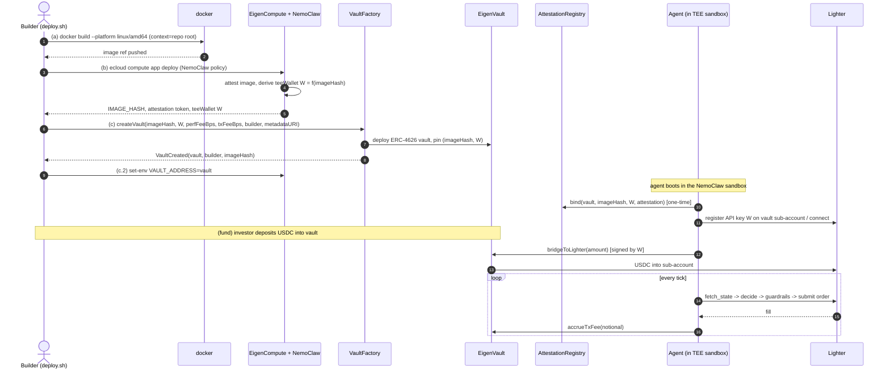

# deploy — LighterClaw deployment pipeline

End-to-end runbook to take the `agent-runtime/` image from **build → deploy on
EigenCompute under NemoClaw → createVault → fund → trade**.

```
deploy/
├── deploy.sh                 # the full idempotent pipeline (set -euo pipefail)
├── eigencompute.app.yaml     # ecloud compute app manifest (NemoClaw-sandboxed)
├── .env.example              # every var the pipeline needs (copy -> .env)
├── .gitignore                # keeps .env (PRIVATE_KEY) out of git
└── README.md                 # this runbook
```

---

## Prerequisites

| Tool | Why | If missing |
|---|---|---|
| `docker` | build the linux/amd64 runtime image | step (a) is skipped, image assumed present |
| `ecloud` | EigenCompute deploy + KMS attestation | **MOCK fallback** emits deterministic IMAGE_HASH/teeWallet |
| `cast` (Foundry) | `VaultFactory.createVault` tx | **MOCK fallback** prints the exact `cast send` and a placeholder vault |
| `jq`, `envsubst` | parse CLI JSON / render the manifest | required for the real (non-mock) paths |

The MOCK fallbacks make the whole pipeline runnable in dev with **no** cloud or
chain access — every mock line is prefixed `[MOCK]` and the final summary flags
that mock values were used.

---

## Quick start

```bash
cp deploy/.env.example deploy/.env
$EDITOR deploy/.env          # set RPC_URL, PRIVATE_KEY, FACTORY_ADDRESS, fees, ...
./deploy/deploy.sh
```

Force the mock path even if the real CLIs are installed (handy for CI):

```bash
MOCK_ECLOUD=1 ./deploy/deploy.sh
```

Output: the new **vault address**, the **IMAGE_HASH**, the **teeWallet**, and
the **live URL**, plus a machine-readable `deploy/deploy.out.json`.

---

## What the pipeline does

1. **(a) `docker build`** the `agent-runtime/Dockerfile` for `linux/amd64` with
   build context = repo root (so it can vendor `./agent-sdk`), then push so
   EigenCompute can pull + attest.
2. **(b) `ecloud compute app deploy`** the rendered `eigencompute.app.yaml`.
   EigenCompute launches the image **under NemoClaw** (using
   `agent-runtime/nemoclaw.policy.yaml`), attests the image, and returns
   `IMAGE_HASH`, the attestation token, and the **KMS-derived teeWallet**
   (`teeWallet = f(imageHash)`). `deploy.sh` parses these from the CLI's
   `--output json`.
3. **(c) `VaultFactory.createVault(VaultParams)`** via `cast send`, passing the
   `imageHash`, `teeWallet`, `perfFeeBps`, `txFeeBps`, `builder`, and
   `metadataURI` from `deploy/.env`. The new vault address is recovered from the
   `VaultCreated` event in the receipt.
4. **(c.2)** Patches `VAULT_ADDRESS` back onto the EigenCompute app
   (`ecloud compute app set-env`) so the in-TEE agent knows which vault it trades
   for (the SDK reads `VAULT_ADDRESS`).
5. **(d)** Prints the vault address + live URL and writes `deploy.out.json`.

After this, **fund** the vault with USDC (`deposit`) and the agent — already
bridging to Lighter and looping `decide → guardrails → submit → accrueTxFee` —
begins trading.

> The factory signature targeted is the README's `IVaultFactory`:
> `createVault((bytes32 imageHash,address teeWallet,uint16 perfFeeBps,uint16 txFeeBps,address builder,string metadataURI))`.
> If your deployed factory's ABI differs, update `CREATE_SIG`/`TUPLE` in
> `deploy.sh` and the `VaultCreated` event selector used to parse the receipt.

---

## Sequence



---

## Security recap (why this is safe by construction)

Two independent walls, enforced outside the strategy's control:

- **NemoClaw sandbox** (`agent-runtime/nemoclaw.policy.yaml`): the agent can
  reach **only** the Lighter host(s) and the RPC host (port 443), read-only
  rootfs, dropped caps, no model egress, KMS mnemonic mounted read-only. A
  compromised strategy can't exfiltrate the TEE key or call arbitrary hosts.
- **On-chain teeWallet gating** (`EigenVault`): funds can only move
  `vault ↔ Lighter sub-account ↔ vault`, even if the TEE key leaks.

`deploy.sh` derives `RPC_HOST` from `RPC_URL` and substitutes it into the
NemoClaw allowlist, so the sandbox's allowed RPC egress always matches the chain
the vault was created on.

---

## Troubleshooting

- **`missing deploy/.env`** — `cp deploy/.env.example deploy/.env` first.
- **`could not parse imageHash/teeWallet`** — your `ecloud` version's JSON shape
  differs; inspect the printed output and adjust the `jq` paths in step (b).
- **`could not auto-parse vault address`** — the factory's `VaultCreated` event
  signature differs; update `VAULT_CREATED_SIG` in `deploy.sh` or read the vault
  from the tx receipt manually.
- **Agent unhealthy after deploy** — `curl <appUrl>/healthz`; before the first
  tick it reports healthy (booting: attestation bind + Lighter handshake). If it
  stays 503, check that the NemoClaw egress allowlist includes your RPC host.
```
